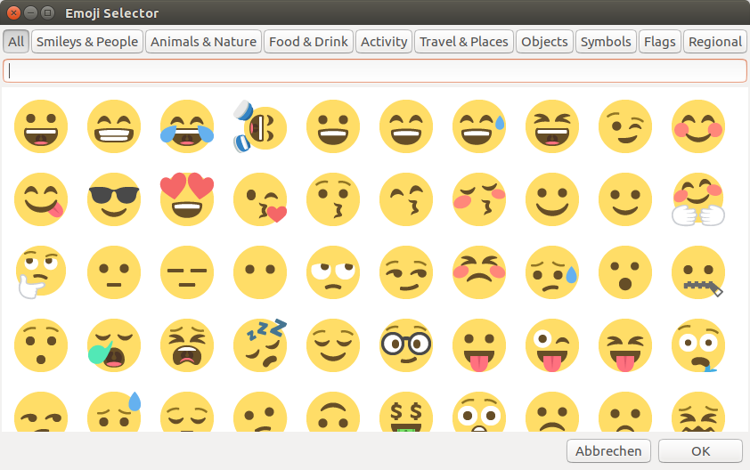

# Emoji Selector



## Goal
The intention is to provide an easy way to input emoji into any text entry field.

This progam is basically just a popup dialog where you can select an emoji. It then will instert the emoji by simulation keystrokes.


## How to install
1. Make sure `python3-gi` and `xdotool` is present an your system.
```
sudo apt install python3-gi xdotool
```
2. git clone this repository
```
git clone https://github.com/andresth/emojiselector.git
```
3. Add a keyboard shortcut.  
Goto `Systemsettings` > `Keyboard` > `Shortcuts` and press the `+` sign.  
Give the shortcut a name and insert this command: `bash -c 'cd /path/to/repository && /usr/bin/python3 ./emojiselector.py'` (replace /path/to/repository with the real path on your system).  
Define a key sequence for the command ( i took `Super+F1`)
4. Enjoy 😎

## Credits
This application uses the [emojione](http://emojione.com) artwork from Rick Moby.

## Known Issues
* The App simulates [`ctrl+shift+u`](https://en.wikipedia.org/wiki/Unicode_input#In_X11_.28Linux_and_other_Unix_variants.29) keystrokes to input unicode characters, which may only work with GTK+.
* The unicode mode (run with parameter `--unicode`) which inputs the character directly migth work wit QT (testing needed)
  * Does not work with Chromium

## Todo
* ~~Multicharacter emoji (i.e skin tone)~~
* Get rid of the `ctrl+shift+u` keysequence and input emoji directly (xdotool can do this)
* Improve UI
  * ~~Set focus to search field~~
  * Use TAB to switch through controls
  * ~~Use RETURN as Ok~~
  * ~~Use ESC as Cancel~~
  * Display recently used emoji
  * User defined favorites
* Find a better way to interface with libxdo
